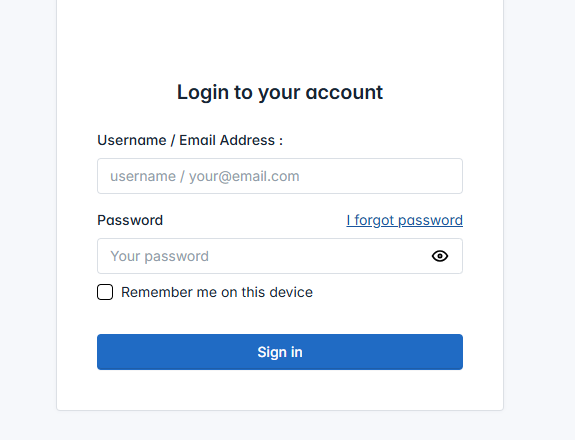

# Personal Management System (PMS)

A secure, scalable **web-based Personal Management System** that helps users manage **finances, tasks, projects, and personal diary entries** from a single unified platform.

Built with **Python, Django, and Django REST Framework**, this project focuses on **clean backend architecture, performance optimization, and user-based data security**.

---

## 🌐 Live Demo

**URL:** https://wpms.wapssolution.com/login/?next=/

## 🎯 Objective

The objective of the **Personal Management System** is to provide users with a **centralized platform** to efficiently manage daily finances, tasks, projects, diary entries, and personal activities.

The system ensures:
- Better financial control
- Improved productivity
- Structured lifestyle management
- Accurate tracking and reporting

---

## 🧩 Overview

The **Personal Management System** is a comprehensive **web-based application** designed to simplify everyday personal and financial management.

Users can:
- Track expenses, earnings, investments, borrowing, and lending
- Manage to-do lists, tasks, and projects
- Maintain a personal diary with mood and location tracking

All data is **strictly user-owned**, ensuring privacy and secure access. Each user can only view and manage their own records through a personalized dashboard.

---

## 🛠️ Technology Stack

- **Backend:** Python, Django, Django REST Framework (DRF)
- **Database:** MySQL (Primary), PostgreSQL (Scalable-ready)
- **Frontend:** HTML5, CSS3, Bootstrap, JavaScript, AJAX
- **DevOps & Tools:** Docker, Git, GitHub
- **Security:** User-based access control & data isolation

---

## ✨ Key Features

### 💰 Financial Management
- Categorized expense tracking with detailed history
- Earnings recording with category-based filtering
- Lending management with return history
- Borrowing records with return tracking
- Investment tracking with **Open / Closed** status
- Auto-generated **date-based financial indexes** for fast reporting

---

### ✅ Task & Productivity
- Daily To-Do list with priority levels:
  - High
  - Medium
  - Low
- Personal task manager with project association
- Task status tracking:
  - Completed
  - Ongoing
  - On Hold
  - Suspended
- Project management with:
  - Start & end dates
  - Status
  - Descriptions

---

### 📓 Diary & Personal Notes
- Daily diary entries with mood tracking:
  - Happy
  - Sad
  - Angry
  - Excited
  - Neutral
  - Normal
- Location-based diary entries
- Tag-based content organization

---

### 🔐 User & Data Security
- Secure user-based data ownership
- Each record linked with:
  - `created_by`
  - `updated_by`
- Access-restricted personal dashboard
- Users can only view and manage their own data

---

### 🚀 Performance & UX
- Clean and intuitive dashboard summarizing all modules
- Quick-access widgets for finances and tasks
- Optimized database indexing for high-performance queries
- Scalable architecture ready for future expansion

---
## 🖼️ Screenshots

> Below are sample screenshots showcasing key features of the application.

### 🔐 Login & Authentication

## 👨‍💻 Role & Responsibilities

- Designed database schema and backend architecture
- Developed RESTful APIs using Django REST Framework
- Implemented authentication and user-based access control
- Optimized database queries and indexing
- Integrated frontend using Bootstrap and AJAX
- Prepared application for containerized deployment with Docker

---

## 📌 Use Cases

- Personal finance tracking
- Task and project management
- Daily journaling with mood tracking
- All-in-one personal productivity solution

---

## 📄 License

This project is intended for **portfolio and demonstration purposes**.  
For commercial usage or customization, please contact the author.

---

## 📬 Contact

**Author:** Anup Mondal  
📧 Email: anup12.m@gmail.com  
💼 LinkedIn: https://www.linkedin.com/in/dsanup/  

---

⭐ If you find this project useful, consider starring the repository.
