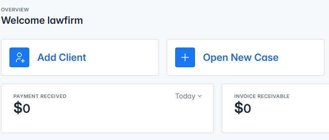
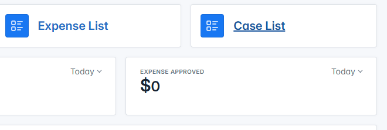
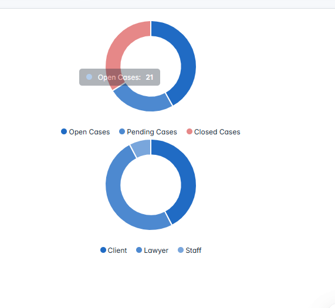
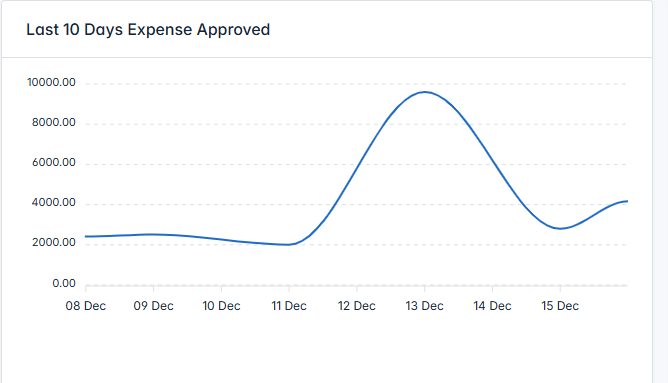
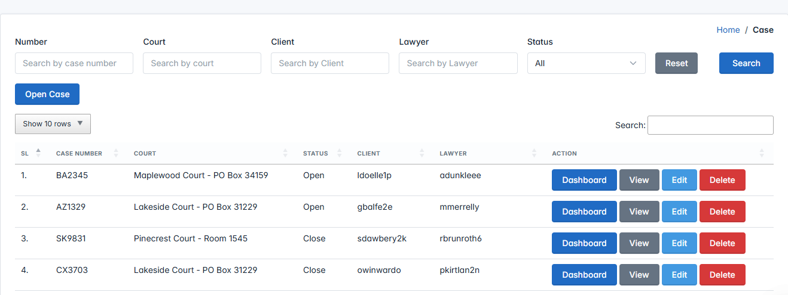
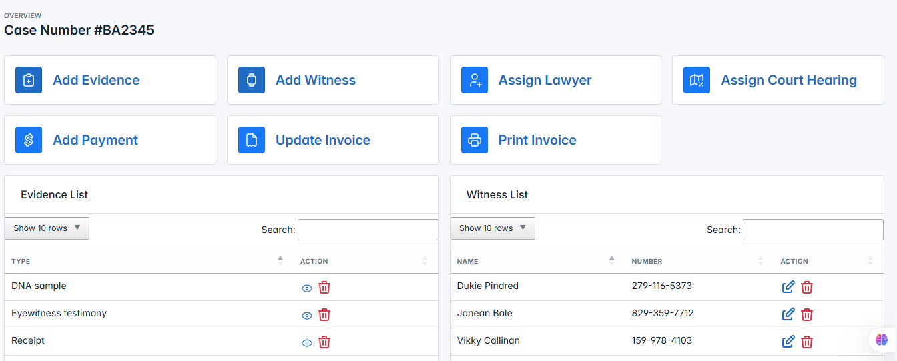
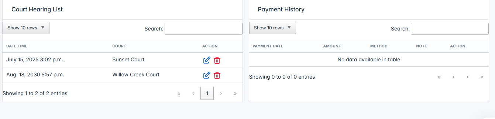
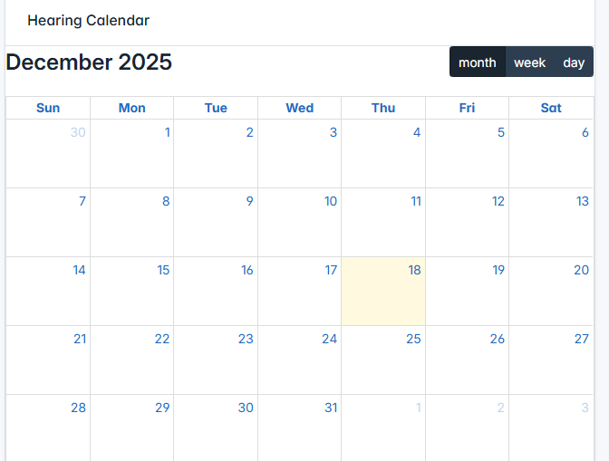
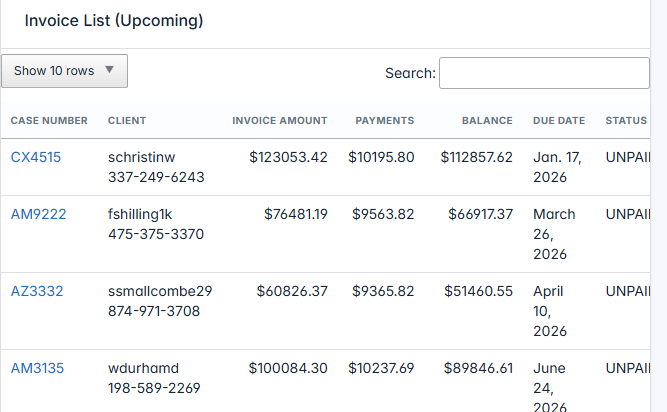
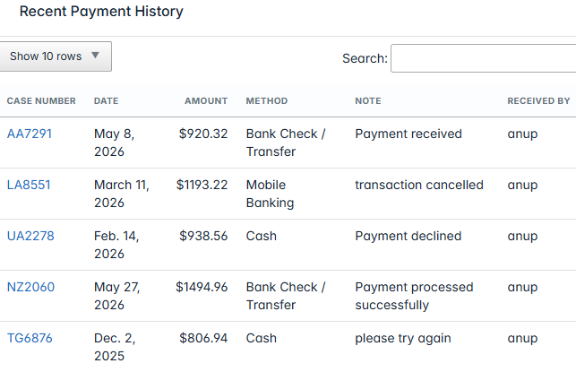

# Law Firm Management System (LFMS)

A secure, scalable **Law Firm Management System** designed to **digitize, automate, and centralize legal operations** for modern law firms.

This platform helps law firms manage **cases, hearings, documents, billing, and payments** efficiently while ensuring **data security, transparency, and operational efficiency**.

---

## 🎯 Objective

The objective of the **Law Firm Management System** is to streamline daily law firm operations by providing a **single, centralized digital platform** for managing legal workflows.

The system reduces manual paperwork, improves collaboration between lawyers and clients, and provides real-time insights into case progress and financials.

---

## 🧩 Overview

The **Law Firm Management System** is a comprehensive **web-based application** built to modernize traditional law firm processes.

It enables law firms to:
- Track cases from registration to closure
- Schedule and monitor court hearings
- Manage legal documents, evidence, and witnesses securely
- Automate invoicing, expense approvals, and payment tracking
- Provide controlled access to lawyers, clients, and administrators

With **role-based access control**, sensitive legal data remains protected while allowing authorized users to access relevant information anytime.

This system is ideal for **small, medium, and large law firms** seeking a reliable, scalable case management solution.

---

## 🛠️ Technology Stack

- **Backend:** Python, Django, Django REST Framework (DRF)
- **Database:** MySQL / PostgreSQL
- **Frontend:** HTML5, CSS3, Bootstrap, JavaScript, AJAX
- **DevOps:** Docker, Git, GitHub
- **Security:** Role-Based Access Control (RBAC), Secure File Storage

---

## ✨ Key Features

### ⚖️ Case & Court Management
- Detailed case profiles with complete case history
- Court and case type management
- Real-time case status tracking

### 📅 Hearing & Scheduling
- Court hearing scheduling and tracking
- Automated hearing updates
- Notification and reminder system

### 👥 Witness & Evidence Management
- Witness profiles linked to cases
- Secure evidence and document upload
- Case-wise document organization

### 💼 Client & Lawyer Access
- Role-based access control:
  - Admin
  - Lawyer
  - Client
- Secure client access to case details and documents

### 💰 Billing & Financial Management
- Automated invoice generation
- Case-wise billing overview
- Payment tracking
- Expense tracking with approval workflow
- Financial reports and summaries

### 📊 Dashboard & Insights
- Dashboard with case summaries
- Lawyer workload and performance insights
- Financial and billing analytics

---

## 🖼️ Screenshots

> Sample screenshots highlighting key modules of the system.

### 🔐 Login & Role-Based Access

### 📊 Dashboard Overview

### ⚖️ Case Management

### 📅 Hearing Schedule

### 💰 Billing & Payments

---

## 👨‍💻 Role & Responsibilities

- Designed system architecture and database schema
- Developed RESTful APIs using Django REST Framework
- Implemented secure role-based access control (RBAC)
- Built document, evidence, and file management modules
- Integrated billing, expense approval, and payment tracking
- Optimized database queries and reporting
- Prepared the system for scalable deployment using Docker

---

## 📈 Business Value (Client-Focused)

- Reduced administrative workload and paperwork
- Improved case visibility and tracking accuracy
- Secure and organized document management
- Faster billing and transparent payment tracking
- Enhanced collaboration between lawyers and clients

---

## 📄 License

This project is intended for **portfolio and demonstration purposes**.  
For customization or commercial deployment, please contact the author.

---

## 📬 Contact

**Author:** Anup Mondal  
📧 Email: anup12.m@gmail.com  
💼 LinkedIn: https://www.linkedin.com/in/dsanup/

---

⭐ Interested in a similar system? Feel free to reach out.
